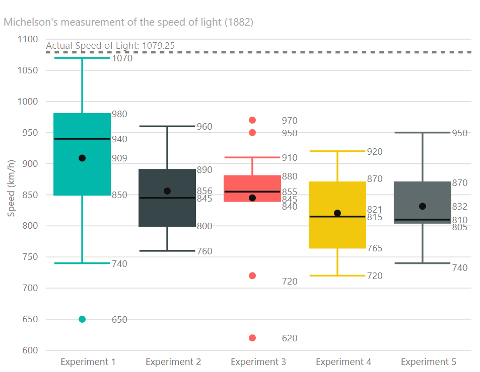

# Power BI Box and Whisker Chart

# Overview
A Box and Whisker chart is a is a convenient way of graphically depicting groups of numerical data through their quartiles.

It shows basic statistical information (five-number summary) of a dataset:
- the 1st and 3rd quartile (box)
- the median (line)
- the mean (dot)
- minimum and maximum value or all values, 1.5x interquartile range [IQR] or a custom percentile value

Outliers (if available) can shown.

See also [Box and Whisker chart at Microsoft Office store](https://store.office.com/en-us/app.aspx?assetid=WA104380831)